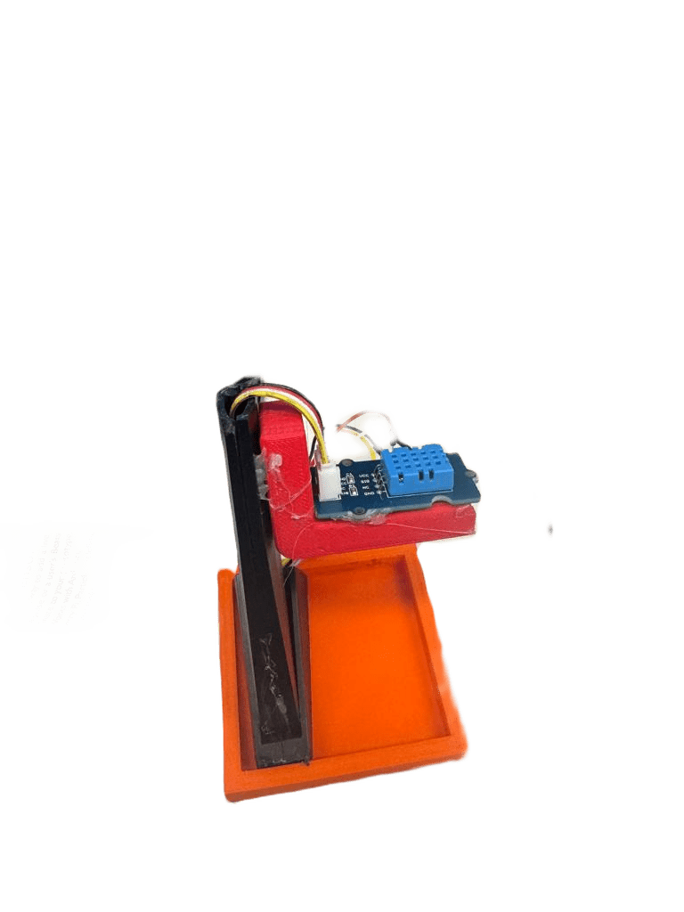
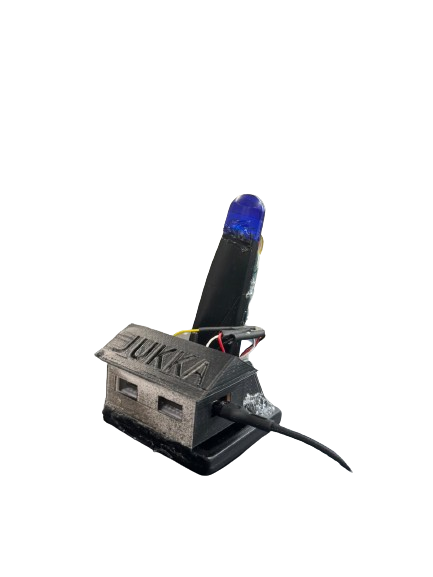
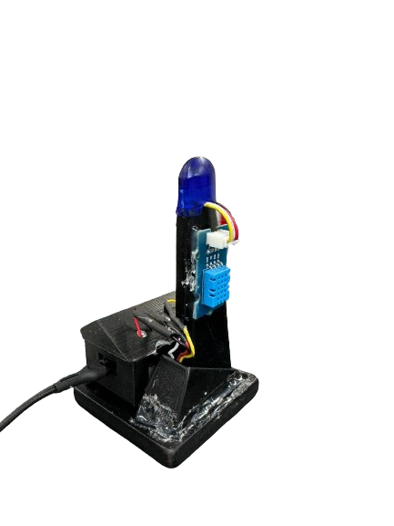

# ESP32 Sääasema IoT-projekti

Tervetuloa sääaseman IoT-projektin pariin, joka on toteutettu ESP32-mikrokontrollerilla. Tämä projekti ei ainoastaan mittaa ympäristötietoja, vaan tarjoaa myös laadukkaan ja helppokäyttöisen verkkosivun reaaliaikaisen datan visualisointiin.

## Ominaisuudet

- **Mittaa ympäristötietoja:** Tämä projekti hyödyntää BME280- ja DHT11-antureita ympäristötietojen tarkkaan mittaamiseen.

- **Tallentaa kerätyt tiedot tietokantaan:** Kerätyt ympäristötiedot tallennetaan automaattisesti tietokantaan, jotta niitä voidaan käsitellä ja analysoida tarvittaessa.

- **Reaaliaikainen seuranta:** Verkkosivu päivittyy automaattisesti, mikä mahdollistaa viimeisimpien ympäristötietojen reaaliaikaisen seurannan ilman manuaalista päivitystä.

- **Näyttää reaaliaikaiset ympäristötiedot verkkosivulla:** Verkkosivulla esitetään käyttäjille ympäristötiedot reaaliajassa selkeällä ja helposti ymmärrettävällä tavalla.

- **Responsiivinen suunnittelu:** Käytämme MDB Bootstrap -kehystä varmistaaksemme, että verkkosivu näyttää hienolta ja toimii saumattomasti millä tahansa laitteella.

## Käytetyt teknologiat

- **ESP32-mikro-ohjain:** Tämä projekti käyttää ESP32-mikro-ohjainta ympäristötietojen keräämiseen ja verkkoyhteyden hallintaan.

- **BME280-anturi:** BME280-anturi on integroitu projektiin ympäristötietojen, kuten lämpötilan, ilmankosteuden ja ilmanpaineen, tarkkaan mittaamiseen.

- **DHT11-anturi:** DHT11-anturi on toinen anturivaihtoehto, jota voidaan käyttää lämpötila- ja ilmankosteustietojen keräämiseen.

- **MDB Bootstrap:** Projekti hyödyntää MDB Bootstrapia, joka on Bootstrap-pohjainen käyttöliittymäkomponenttikirjasto, varmistaakseen verkkosivun responsiivisen suunnittelun ja ammattimaisen ulkoasun.

## Sääaseman kuvat

*Kuva 2: Kytkentä*

*Kuva 2: Verkkosivunäkymä*

| Prototype                           | Valmis                              | Valmis                            |
| ----------------------------------- | ----------------------------------- |---------------------------------- |
|  |     |   |

*Kuva 3: Verkkosivunäkymä*

| LG                                  | MD                                  | SM                                          |
| ----------------------------------- | ----------------------------------- | ------------------------------------------- |
|   |   |      |

## Lisenssi

Tämä projekti on lisensoitu [MIT-lisenssillä](LICENSE). Voit vapaasti käyttää ja muokata sitä omiin tarkoituksiisi.

## Yhteydenotto

Jos sinulla on kysyttävää tai kommentteja, voit ottaa yhteyttä sähköpostitse osoitteeseen [email@example.com](mailto:email@example.com).

---

Muista lisätä tarvittavat tiedot ja muokata polkuja sekä tiedostonimiä vastaamaan projektisi rakennetta ja tarpeita. Lisäksi voit muokata ulkoasua ja lisätä interaktiivisuutta HTML- ja JavaScript-koodilla tarpeen mukaan.
